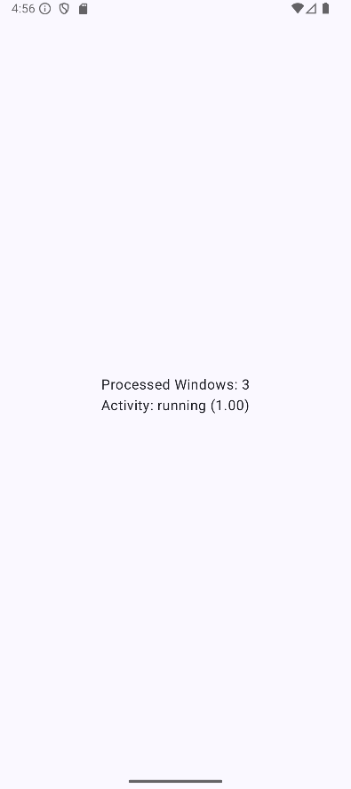

# WalkRunClassifier

An Android application that classifies stationary, walking, and running activity in real-time
using accelerometer sensor data and an on-device TensorFlow Lite model.

<!-- 
Optional: Add a screenshot or a short GIF of the app in action here 
 
-->

<!-- 
**Video Demonstrations:**
- How to run tests: [Link to your video when ready]
- How to deploy and run on a real phone: [Link to your video when ready] 
-->

## Table of Contents

- [About The Project](#about-the-project)
- [Features](#features)
- [Built With](#built-with)
- [Getting Started](#getting-started)
    - [Prerequisites](#prerequisites)
    - [Installation](#installation)
- [Usage](#usage)
- [Model Details](#model-details)
- [Data Handling](#data-handling)
    - [Real-time Data](#real-time-data-realaccelerometerdatasourcekt)
    - [Test Data](#test-data-csvaccelerometerdatasourcekt)
- [Code Structure](#code-structure)
- [License](#license)
- [Acknowledgements](#acknowledgements)

## About The Project

WalkRunClassifier provides a simple interface to demonstrate on-device activity recognition.
It leverages the built-in accelerometer to gather motion data, preprocesses this data into windows,
and then feeds it to a pre-trained TensorFlow Lite model to predict whether the user is 
stationary, walking, or running. The number of processed windows, predicted activity and its confidence score are 
displayed on the screen.

This project is a completed example showcasing:
- Real-time sensor data collection and processing on Android.
- Integration of a TensorFlow Lite model for on-device inference.
- Use of Kotlin Flows and Coroutines for managing asynchronous data streams.
- UI implementation with Jetpack Compose.

## Features

- Real-time accelerometer data collection.
- Configurable sensor sampling rate (currently set around 26Hz).
- Preprocessing:
    - Conversion of raw sensor data (m/s²) to milli-g (mg).
    - Clamping of milli-g values to a ±4000mg range.
    - Windowing of sensor data (e.g., 10-second windows with 90% overlap).
    - Normalization of windowed data (division by 4000.0f) before model input.
- On-device classification using a pre-trained TensorFlow Lite model.
- Display of predicted activity label (stationary, walking, running) and confidence score plus the number of processed windows.
- CSV-based test data replay capability for development and debugging (used in Instrumented Tests).

## Built With

- [Kotlin](https://kotlinlang.org/)
- Android SDK:
    - `minSdk = 24`
    - `compileSdk = 36`
    - `targetSdk = 36`
- [TensorFlow Lite](https://www.tensorflow.org/lite) (`org.tensorflow:tensorflow-lite`)
- Kotlin Coroutines & Flow
- Jetpack Compose:
    - `androidx.compose.ui:ui`
    - `androidx.compose.material3:material3`
    - `androidx.compose.foundation:foundation` (implicitly via BOM)
- Android Jetpack:
    - `androidx.core:core-ktx`
    - `androidx.lifecycle:lifecycle-runtime-ktx`
    - `androidx.activity:activity-compose`
    - `androidx.lifecycle:lifecycle-viewmodel-compose` (Used in `MainActivity`)
- Testing:
    - JUnit 4
    - AndroidX Test (JUnit)
    - Compose UI Tests
- [Android Studio](https://developer.android.com/studio) (Developed with Android Studio Narwhal | 2025.1.1)

## Getting Started

To get a local copy up and running, follow these simple steps.

### Prerequisites

- Android Studio (e.g., Iguana | 2023.2.1 or later recommended).
- Android SDK Platform for API level 34 (or 36 if available) installed.
- An Android device (API 24+) or emulator with an accelerometer sensor.
    - For physical devices: Enable Developer Options and USB Debugging.

### Installation

1.  **Clone the repository:**

## Usage

1.  **Launch the App:**
    Find and tap the "WalkRunClassifier" icon in your app drawer or on your home screen.

2.  **Initial State:**
    Upon launching, the screen will initially display "Activity: initializing". This means the app is active and warming up by collecting the initial accelerometer data needed for the first classification window.

3.  **Perform an Activity:**
    To see the app in action, simply begin one of the following activities:
    *   Stay **Stationary** (e.g., sitting or standing still).
    *   Start **Walking**.
    *   Start **Running** or jogging.

4.  **View Classification:**
    After a brief period (new window classification every second), the display will update to show:
    *   The **Predicted Activity**: "Stationary", "Walking", or "Running".
    *   The **Confidence Score**: A value in parentheses (e.g., `(0.92)`) indicating how confident the model is in its prediction.

5.  **Continuous Updates:**
    The app continuously processes accelerometer data. As you continue your activity or switch to a different one, the displayed prediction and confidence score will update accordingly to reflect the current movement pattern. There are no buttons to press; the classification is automatic and ongoing.

## Model Details

The machine learning model used in this application was trained to classify stationary, walking, and running activities based on accelerometer data.
For comprehensive information regarding the model's architecture, training process, dataset used, and experimentation details, please refer to the dedicated model training repository:

**➡️ [Human Activity Recognition Model Training Repository](https://github.com/ChristophKarlHeck/human-activity-recognition)**

Below is a summary of the model's specifics as integrated into this Android application:

-   **Model File:** The TensorFlow Lite model is located at `app/src/main/assets/model.tflite`.
-   **Input:**
    -   Type: Floating point numbers.
    -   Shape: `[1, 260, 3]`
        -   `1`: Batch size.
        -   `260`: Number of time steps/samples in the window (10 seconds * 26 Hz).
        -   `3`: Features per time step (x, y, z accelerometer values).
    -   Preprocessing (within this Android app):
        1.  Raw accelerometer (x, y, z) readings are taken in m/s².
        2.  Converted to milli-g (mg) using standard gravity (9.81 m/s²).
        3.  Clamped to a ±4000mg range.
        4.  Collected into windows of 260 samples, with a 90% overlap between consecutive windows.
        5.  Each value (x, y, z) in the window is then normalized by dividing by 4000.0f (resulting in values approximately between -1.0 and 1.0).
-   **Output:**
    -   Type: Floating point numbers representing probabilities.
    -   Shape: `[1, 3]` (Batch size, Number of classes).
    -   Interpretation: The output array contains the confidence scores for each activity class in the following order:
        1.  Stationary
        2.  Walking
        3.  Running
    -   The class with the highest score is chosen as the prediction.

## Data Handling

The application processes accelerometer data from two distinct sources: real-time sensor input from the device and pre-recorded data from CSV files for testing and development. 
Both sources ultimately provide data via the `AccelerometerDataSource` interface, which emits a Flow of `AccelerometerData` objects.

### Real-time Data (`RealAccelerometerDataSource.kt`)

This component is responsible for sourcing live accelerometer data from the Android device's hardware.

-   **Location:** `com.example.walkrunclassifier.sensors.RealAccelerometerDataSource`
-   **Sensor:** Utilizes the device's built-in `Sensor.TYPE_ACCELEROMETER`.
-   **Sampling Rate:**
    -   Configured via a `desiredFrequencyHz` parameter passed to its constructor (e.g., 26 Hz).
    -   This frequency is converted into a sampling period in microseconds, which is then requested from the `SensorManager`.
-   **Data Transformation:**
    1.  Receives raw sensor events (`SensorEvent`) where `event.values[0]`, `event.values[1]`, and `event.values[2]` represent acceleration on the x, y, and z axes in m/s².
    2.  Each of these raw m/s² values is immediately processed by the `convertAndClampToMilliG` utility function (from `SensorDataUtils.kt`). This function:
        -   Converts the m/s² value to milli-g (mg) using the standard gravity constant (9.80665 m/s²).
        -   Clamps the resulting milli-g value to a range of ±4000mg since the sensor used for acquiring the training data has this resolution.
-   **Output:** Emits a `Flow<AccelerometerData>`, where each `AccelerometerData` object contains:
    -   `timestamp`: The original timestamp from the `SensorEvent` (in nanoseconds).
    -   `x`, `y`, `z`: The accelerometer readings converted to milli-g and clamped.

### Test Data (`CsvAccelerometerDataSource.kt`)

This data source allows for replaying accelerometer data from CSV files, primarily for instrumented testing and reproducible debugging scenarios.

-   **Location:** `com.example.walkrunclassifier.testutils.CsvAccelerometerDataSource`
-   **Purpose:** To provide a consistent and controllable stream of accelerometer data from pre-recorded files, mimicking real sensor input.
-   **CSV File Location:**
    -   Reads CSV files (e.g., `stationary.csv`, `walking.csv`, `running.csv`) from the `app/src/main/assets/` directory.
    -   These files are accessed using the `AssetManager` from the test context (e.g., in an instrumented test environment).
-   **CSV File Format:**
    -   Each line in the CSV file is expected to contain **three comma-separated floating-point values** representing the x, y, and z axes of the accelerometer in milli-g.
    -   Timestamps are **generated by this data source** (`System.nanoTime()`) at the moment of reading/emission; they are not read from the CSV file.
    -   The presence of a header line in the CSV can be handled by the `skipHeaderLine` constructor parameter (defaults to `false`, meaning no header is expected).
-   **Data Emission:**
    -   Simulates real-time sensor data emission using an `emissionDelayMillis` constructor parameter (defaults to a delay equivalent to ~26Hz).
    -   Emits a `Flow<AccelerometerData>`, where each `AccelerometerData` object contains:
        -   `timestamp`: A generated timestamp (nanoseconds).
        -   `x`, `y`, `z`: The floating-point values read directly from the current line of the CSV file.

## Code Structure

The project is organized into several key packages under `com.example.walkrunclassifier` (the base package):

-   **`(root package)` / `com.example.walkrunclassifier`**:
    -   `MainActivity.kt`: The main entry point of the application.
        -   Initializes and manages the `ActivityClassifier` (for ML model inference) and `AccelerometerFlowManager` (for sensor data processing).
        -   Hosts the Jetpack Compose UI, displaying the number of processed sensor windows and the live activity classification.
        -   Collects windowed accelerometer data using Kotlin Flows and `lifecycleScope`.
        -   Processes data windows with the classifier and updates UI state (e.g., `currentActivityClassification`, `processedWindowCount`) directly within the Activity.
        -   Includes a mechanism to use a test data source (`testAccelerometerFlowManager`) for instrumented testing.

-   **`ml` package (`com.example.walkrunclassifier.ml`)**:
    -   `ActivityClassifier.kt`: Handles all TensorFlow Lite model interactions. It loads `model.tflite` from assets, preprocesses input windows of accelerometer data (normalizing to [-1,1]), runs inference, interprets the output probabilities into activity labels (stationary, walking, running) with confidence scores, and manages TFLite resources.
    
-   **`sensors` package (`com.example.walkrunclassifier.sensors`)**:
    -   `AccelerometerData.kt`: A data class representing a single accelerometer reading (timestamp, x, y, z values in milli-g).
    -   `AccelerometerDataSource.kt`: An interface defining the contract for providing a `Flow` of `AccelerometerData`.
    -   `RealAccelerometerDataSource.kt`: Implementation of `AccelerometerDataSource` that provides real-time data from the device's hardware accelerometer. Handles sensor registration, data conversion (m/s² to milli-g and clamping), and emits `AccelerometerData`.
    -   `AccelerometerFlowManager.kt`: Manages the stream of `AccelerometerData` from a data source. It applies transformations like buffering and then windows the continuous data stream into segments (e.g., 10-second windows with 90% overlap) suitable for the `ActivityClassifier`.
    -   `AccelerometerWindow.kt`: A data class representing a window of accelerometer data (a list of `AccelerometerData` points) ready to be fed into the model after normalization.

-   **`testutils` package (`com.example.walkrunclassifier.testutils`)**:
    -   *(Assuming `CsvAccelerometerDataSource.kt` is here, as per previous discussions. If it's elsewhere, like directly in `sensors`, please clarify.)*
    -   `CsvAccelerometerDataSource.kt`: An implementation of `AccelerometerDataSource` used for testing. It reads accelerometer data from CSV files stored in `app/src/main/assets/`, allowing for repeatable test scenarios by simulating sensor input.

-   **`ui.theme` package (`com.example.walkrunclassifier.ui.theme`)**:
    -   `Color.kt`, `Theme.kt`, `Type.kt`: Standard Jetpack Compose files defining the application's color palette, overall theme, and typography.

-   **`util` package (`com.example.walkrunclassifier.util`)**:
    -   `SensorDataUtils.kt`: Contains utility functions related to sensor data, most notably `convertAndClampToMilliG` for converting raw accelerometer readings to clamped milli-g values.
    -   `FlowExtensions.kt`: *(If you have specific Kotlin Flow extension functions that are generally useful, briefly mention their purpose here. If it's very specific, it might not need a general mention).* Contains utility extension functions for working with Kotlin Flows, potentially for custom buffering or timing operations.

